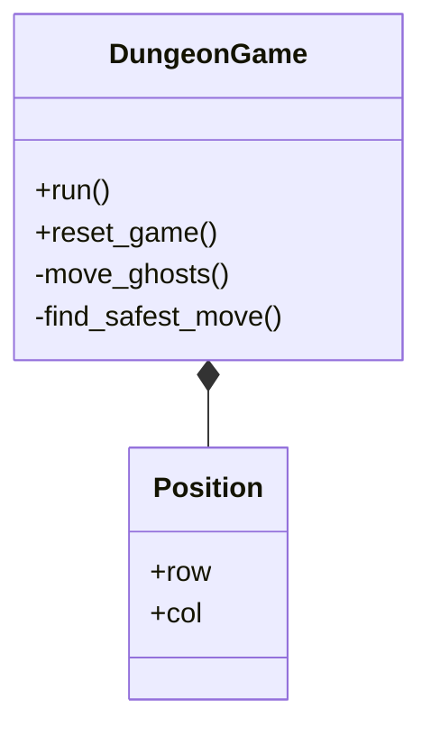

<div align="center">

# 🎮 Dungeon Pathfinding Game

[](https://opensource.org/licenses/MIT)
[](http://www.cplusplus.org/)
[](https://www.raylib.com/)

A sophisticated C++ implementation of a Pac-Man-like game showcasing advanced pathfinding algorithms. Navigate through a maze, collect food, and avoid intelligent ghosts that use different pathfinding strategies!

[Features](#features) • [Installation](#installation) • [Usage](#usage) • [Documentation](#documentation) • [Contributing](#contributing)

---

</div>

## 🌟 Features

<div align="center">

| 🎯 Gameplay | 🤖 Technical | 🎨 Visual |
|------------|--------------|-----------|
| Dynamic ghost AI | Three pathfinding algorithms | Real-time path visualization |
| Auto-solver mode | Configurable parameters | Score tracking |
| Multiple difficulty levels | Safety-first pathfinding | Path analysis display |

</div>

### 🎯 Key Highlights

- **Multiple Pathfinding Algorithms**
  - 🔹 A* (A-Star): Optimal pathfinding with heuristics
  - 🔹 Dijkstra's Algorithm: Guaranteed shortest path
  - 🔹 Floyd-Warshall: All-pairs shortest path

- **Smart Auto-solver**
  - 🔹 Advanced safety considerations
  - 🔹 Emergency escape strategies
  - 🔹 Dynamic path recalculation

## 🚀 Installation

### Prerequisites

```bash
# Required packages
🔸 C++ compiler (C++11 or higher)
🔸 Raylib graphics library
🔸 Make (optional)
```

### Quick Start

```bash
# Clone repository
git clone https://github.com/yourusername/dungeon-pathfinding.git
cd dungeon-pathfinding

# Build project
g++ -o dungeon_game main.cpp -lraylib -lGL -lm -lpthread -ldl -lrt -lX11

# Run game
./dungeon_game
```

## 🎮 Controls

<div align="center">

| Key | Action | | Key | Action |
|-----|--------|-|-----|--------|
| ⬆️ | Move Up | | `A` | A* Algorithm |
| ⬇️ | Move Down | | `D` | Dijkstra Algorithm |
| ⬅️ | Move Left | | `F` | Floyd-Warshall |
| ➡️ | Move Right | | `Space` | Toggle Auto-solve |
| `Enter` | Restart Game | | `Esc` | Quit Game |

</div>

## 🎯 Game Elements

<div align="center">

| Element | Description |
|---------|-------------|
| 🟡 Yellow Circle | Player (Dungeon) |
| 🔴 Red Circles | Ghosts |
| ⚪ White Dots | Food |
| 🟦 Blue Rectangles | Walls |
| 📈 Green Lines | Path Analysis |

</div>

## 🔧 Technical Details

### Ghost AI Behavior
```cpp
⏱️ Movement Frequency: Every 25 frames
🎮 Game FPS: 60
🤖 AI Type: Independent tracking per ghost
```

### Auto-solver Strategy
- 🧠 Advanced A* implementation
- 🛡️ Safety-distance calculations
- 🔄 Dynamic path updates

## 📚 Documentation

### Class Structure


## 🤝 Contributing

We welcome contributions! Here's how you can help:

1. 🍴 Fork the repository
2. 🔧 Create your feature branch
3. 💻 Commit your changes
4. 🚀 Push to the branch
5. 🎯 Open a Pull Request

## 📜 License

This project is licensed under the MIT License - see the [LICENSE](LICENSE) file for details.

<div align="center">

## 🙏 Acknowledgments

[](https://www.raylib.com/)
[](https://en.wikipedia.org/wiki/Pac-Man)

Special thanks to the open-source community and all contributors!

---

<i>Made with ❤️ by developers, for developers</i>

</div>
