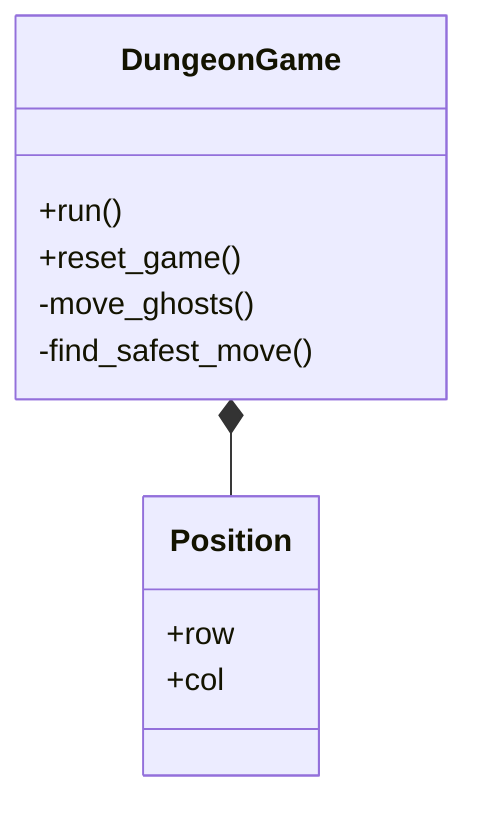

<div align="center">

# 🎮 Dungeon Pathfinding Game

[](https://opensource.org/licenses/MIT)
[](http://www.cplusplus.org/)
[](https://www.raylib.com/)

A sophisticated C++ implementation of a Dungeon game showcasing advanced pathfinding algorithms. Navigate through a maze, collect food, and avoid intelligent ghosts that use different pathfinding strategies!

[Features](#features) • [Usage](#usage) • [Documentation](#documentation) • [Contributing](#contributing) • [Known Issues](#known-issues)

---

</div>

## 🌟 Features

<div align="center">

| 🎯 Gameplay | 🤖 Technical | 🎨 Visual |
|------------|--------------|-----------|
| Dynamic ghost behavior | Three pathfinding algorithms | Real-time path visualization |
| Auto-solver mode | Configurable parameters | Score tracking |
| Multiple difficulty levels | Safety-first pathfinding | |

</div>

### 🎯 Key Highlights

- **Multiple Pathfinding Algorithms**
  - 🔹 __A* (A-Star)__: 
    - A* is an informed search algorithm that uses heuristics to optimize pathfinding. It combines features of Dijkstra's algorithm and a heuristic that estimates the cost from the current node to the target. This allows it to efficiently find the shortest path while minimizing the number of nodes it explores, making it particularly effective for navigation tasks.
  
  - 🔹 **Dijkstra's Algorithm**: 
    - This classic algorithm guarantees the shortest path from a starting node to all other nodes in a graph with non-negative edge weights. It systematically explores nodes, updating the shortest known distances until it finds the optimal path. Dijkstra’s algorithm is widely used for routing and navigation due to its reliability.
  
  - 🔹 **Floyd-Warshall**: 
    - The Floyd-Warshall algorithm is designed to find the shortest paths between all pairs of nodes in a weighted graph. It uses a dynamic programming approach to iteratively update the shortest path between each pair of nodes, allowing it to handle graphs with both positive and negative weights. This algorithm is useful for dense graphs where the number of edges is high.

- **Smart Auto-solver**
  - 🔹 Advanced safety considerations
  - 🔹 Emergency escape strategies
  - 🔹 Dynamic path recalculation


## 🎮 Controls

<div align="center">

| Key | Action | | Key | Action |
|-----|--------|-|-----|--------|
| ⬆️ | Move Up | | `A` | A* Algorithm |
| ⬇️ | Move Down | | `D` | Dijkstra Algorithm |
| ⬅️ | Move Left | | `F` | Floyd-Warshall |
| ➡️ | Move Right | | `Space` | Toggle Auto-solve |
| `Enter` | Restart Game | | `Esc` | Quit Game |

</div>

## 🎯 Game Elements

<div align="center">

| Element | Description |
|---------|-------------|
| 🟡 Yellow Circle | Player (Dungeon) |
| 🔴 Red Circles | Ghosts |
| ⚪ White Dots | Food |
| 🟦 Blue Rectangles | Walls |

</div>

## 🔧 Technical Details

### Ghost Behavior
```cpp
⏱️ Movement Frequency: Every 25 frames
🎮 Game FPS: 60
```

### Auto-solver Strategy
- 🧠 Advanced A* implementation
- 🛡️ Safety-distance calculations
- 🔄 Dynamic path updates

## 📚 Documentation

### Class Structure


## 🤝 Contributing

We welcome contributions! Here's how you can help:

1. 🍴 Fork the repository
2. 🔧 Create your feature branch
3. 💻 Commit your changes
4. 🚀 Push to the branch
5. 🎯 Open a Pull Request

## 📜 License

This project is licensed under the MIT License - see the [LICENSE](LICENSE) file for details.

<div align="center">

## 🙏 Acknowledgments

[](https://www.raylib.com/)
[](https://en.wikipedia.org/wiki/Pac-Man)

Special thanks to the open-source community and all contributors!

---

<i>Made with ❤️ by developers, for developers</i>

</div>
